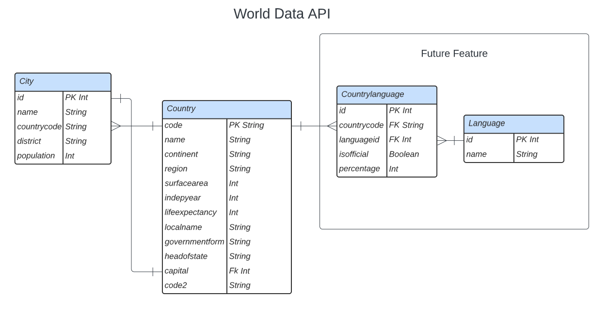

# World Data API

https://world-data-api.herokuapp.com/api/docs

Took an existing large dataset and built a REST API for searching data pertaining to countries and cities around the world.


---

## Tech Used
- Python
- Flask
- PostgreSQL
- SQLAlchemy
- Swagger / Open API UI

---

<!--  -->


## Ways to Explore

- Visit [`/api/docs`](https://world-data-api.herokuapp.com/api/docs) to explore Swagger UI.
- Hit routes directly from a browser.
- Use your favorite HTTP client.

https://world-data-api.herokuapp.com/api/

---

## Routes
Use query params in isolation or in combination.

### Country
Countries by search term.<br>
`/api/countries/?search=<search-term>`

Countries by name.<br>
`/api/countries?name=<country-name>`

Countries by continent.<br>
`/api/countries?continent=<continent-name>`

Countries by government form.<br>
`/api/countries?governmentform=<government-form>`

Countries with population greater than / less than...<br>
`/api/cities?population=gt:10000000`

Countries with life expectancy greater than / less than...<br>
`/api/countries?lifeexpectancy=gt:80`

Countries with surface area greater than / less than...<br>
`/api/countries?surfacearea=gt:1000000`

Return type
```json
{
  "_length": 0, // number of countries returned
  "countries": [] // array of country objects
}
```

---

### City
Cities by search term.<br>
`/api/cities/?search=<search-term>`

Cities within a given country.<br>
`/api/cities?country=<country-name>`

Capital city of a given country.<br>
`/api/cities?capitalof=<country-name>`

Cities by with population greater than / less than...<br>
`/api/cities?population=gt:1000000`

Return type
```json
{
  "_length": 0, // number of cities returned
  "cities": [] // array of city objects
}
```

---

### Future Features
Add a spoken language component to the API.

Countries that speak a given language.<br>
`/api/countries?language=<language>`

All languages spoken in a given country.<br>
`/api/languages?country=<country-name>`

All official languages spoken in a given country.<br>
`/api/languages?country=<country-name>&isofficial=true`

---
